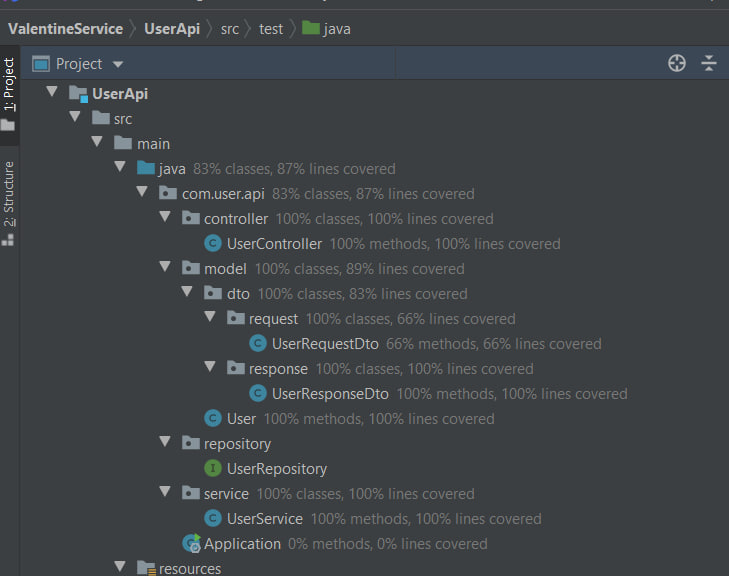

# Valentine Service


## Contents
+ [Overview](#Overview) 
+ [REST Endpoints](#Rest-end-points)
+ [Used Technologies](#Used-Technologies) 
+ [Project Structure](#Project-structure)
+ [Test Coverage](#Test-Coverage)

<a name="Overview"></a>
## Overview
Valentine service is small spring boot API example application for cloud databases practice
<a name="Rest-end-points"></a>
## REST end points: 
```
POST: /v1/user
GET: /v1/user/{id}
PUT: /v1/user/{id}
DELETE: /v1/user/{id}
```

<a name="Used-Technologies"></a>
## Used Technologies
* Java version 11
* Spring boot, data, web
* Azure cloud MySQL database
* Junit and Mockito (testing)

<a name="Project-structure"></a>
## Project structure
Project implemented refers to an n-tier structure and has three layers:

1. Presentation layer (controllers)
1. Application layer (service)
3. Data access layer (DAO)

<a name="Test-Coverage"></a>
## Test Coverage
As you can see test coverage by unit tests reaching 87%

